# Sơ Đồ UML và Flowchart - Dự Án VacTrack

## 1. Sơ Đồ UML Class Diagram

```mermaid
classDiagram
    %% Data Models
    class User {
        +String id
        +String email
        +String name
        +String fullName
        +Int age
        +String dob
        +String address
        +String phone
        +String role
        +String photoUrl
    }

    class Appointment {
        +String id
        +String userId
        +String serviceName
        +String date
        +String time
        +AppointmentStatus status
        +Int price
        +Long createdAt
    }

    class AppointmentStatus {
        <<enumeration>>
        PENDING
        CONFIRMED
        COMPLETED
        CANCELLED
    }

    class Service {
        +String id
        +String name
        +String description
        +Int price
        +Int icon
    }

    class BookingRequest {
        +String userId
        +String serviceId
        +String facilityId
        +String date
        +String time
        +Int doseNumber
        +String notes
    }

    class BookingResponse {
        +Boolean success
        +String message
        +BookingDetail booking
    }

    class BookingDetail {
        +String id
        +String userId
        +String serviceId
        +String facilityId
        +String facilityName
        +String date
        +String time
        +String status
        +Int doseNumber
        +Int price
        +String paymentStatus
        +String doctorName
    }

    class AuthRequest {
        +String email
        +String password
    }

    class AuthResponse {
        +String token
        +User user
        +String message
    }

    %% ViewModels
    class AuthViewModel {
        -AuthRepository authRepository
        -MutableStateFlow~AuthState~ _authState
        +StateFlow~AuthState~ authState
        +login(email: String, password: String)
        +register(email: String, password: String, name: String, phone: String)
        +forgotPassword(email: String)
        +resetPassword(token: String, newPassword: String)
        -checkCurrentUser()
    }

    class AuthState {
        +Boolean isLoading
        +User user
        +Boolean isLoggedIn
        +String error
        +String message
        +String token
    }

    class HomeViewModel {
        -AppointmentRepository appointmentRepository
        -MutableStateFlow~HomeState~ _state
        +StateFlow~HomeState~ state
        +loadAppointments()
        +loadBookings()
        +toggleMenu()
    }

    class HomeState {
        +Boolean menuExpanded
        +Boolean isLoading
        +String error
        +List~Appointment~ appointments
        +List~BookingDetail~ bookings
    }

    class ServiceViewModel {
        -ServiceRepository serviceRepository
        -MutableStateFlow~ServiceState~ _serviceState
        +StateFlow~ServiceState~ serviceState
        +loadServices()
        +selectService(service: Service)
        +getServiceById(id: String)
    }

    class ServiceState {
        +List~Service~ services
        +Service selectedService
        +Boolean isLoading
        +String error
    }

    class AppointmentViewModel {
        -AppointmentRepository repository
        -MutableStateFlow~AppointmentState~ _state
        +StateFlow~AppointmentState~ state
        +updateName(name: String)
        +updateBirthday(birthday: String)
        +updatePhone(phone: String)
        +updateInsuranceId(insuranceId: String)
        +bookAppointment(token: String, userId: String, serviceId: String, facilityId: String, date: String, time: String)
        +fetchBookingHistory(token: String, userId: String)
    }

    class AppointmentState {
        +String name
        +String birthday
        +String phone
        +String insuranceId
        +Boolean isLoading
        +String error
        +String message
        +List~BookingDetail~ history
    }

    class SharedViewModel {
        -AuthRepository authRepository
        -MutableStateFlow~SharedState~ _sharedState
        +StateFlow~SharedState~ sharedState
        +setCurrentUser(user: User)
        +clearCurrentUser()
        +toggleTheme()
        +setTheme(isDark: Boolean)
        -checkCurrentUser()
    }

    class SharedState {
        +User currentUser
        +Boolean isDarkTheme
        +Boolean isLoggedIn
        +String token
        +String userId
        +String selectedServiceId
        +String selectedFacilityId
    }

    %% Repositories
    class AuthRepository {
        -FirebaseAuth firebaseAuth
        +loginWithEmail(email: String, password: String) Result~AuthResponse~
        +register(email: String, password: String, name: String, phone: String) Result~AuthResponse~
        +forgotPassword(email: String) Result~String~
        +resetPassword(token: String, newPassword: String) Result~String~
        +getCurrentUser() User?
        +logout()
    }

    class AppointmentRepository {
        -Retrofit retrofit
        -BookingApiService bookingApi
        +createAppointment(userId: String, serviceName: String, date: String, time: String, price: Int) Result~Appointment~
        +getAppointmentsByUserId(userId: String) Result~List~Appointment~~
        +updateAppointmentStatus(appointmentId: String, status: AppointmentStatus) Result~Appointment~
        +cancelAppointment(appointmentId: String) Result~Boolean~
        +bookAppointmentWithApi(token: String, request: BookingRequest) Result~BookingResponse~
        +getBookingHistory(token: String, userId: String) Result~List~BookingDetail~~
    }

    class ServiceRepository {
        +getServices() List~Service~
        +getServiceById(id: String) Service?
    }

    %% Relationships
    User ||--o{ Appointment : "has"
    User ||--o{ BookingDetail : "has"
    Service ||--o{ BookingDetail : "includes"
    AppointmentStatus ||--o{ Appointment : "defines"
    
    AuthViewModel --> AuthRepository : "uses"
    AuthViewModel --> AuthState : "manages"
    AuthViewModel --> User : "manages"
    AuthViewModel --> AuthResponse : "handles"
    
    HomeViewModel --> AppointmentRepository : "uses"
    HomeViewModel --> HomeState : "manages"
    HomeViewModel --> Appointment : "displays"
    HomeViewModel --> BookingDetail : "displays"
    
    ServiceViewModel --> ServiceRepository : "uses"
    ServiceViewModel --> ServiceState : "manages"
    ServiceViewModel --> Service : "manages"
    
    AppointmentViewModel --> AppointmentRepository : "uses"
    AppointmentViewModel --> AppointmentState : "manages"
    AppointmentViewModel --> BookingRequest : "creates"
    AppointmentViewModel --> BookingDetail : "fetches"
    
    SharedViewModel --> AuthRepository : "uses"
    SharedViewModel --> SharedState : "manages"
    SharedViewModel --> User : "manages"
    
    AuthRepository --> User : "manages"
    AuthRepository --> AuthResponse : "returns"
    AppointmentRepository --> Appointment : "manages"
    AppointmentRepository --> BookingDetail : "manages"
    ServiceRepository --> Service : "provides"
```

## 2. Sơ Đồ UML Sequence Diagram - Quy Trình Đăng Nhập

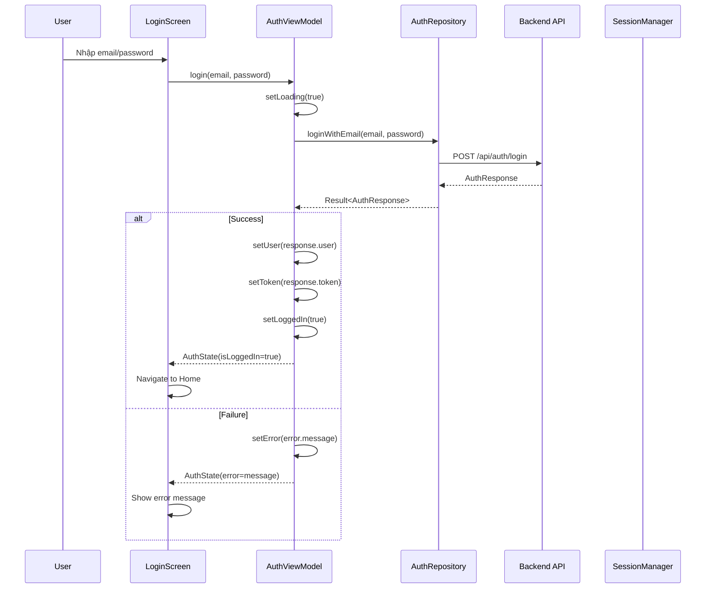

## 3. Sơ Đồ UML Sequence Diagram - Quy Trình Đặt Lịch

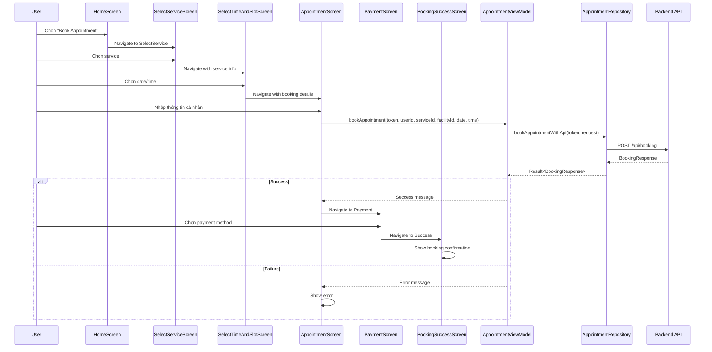

## 4. Flowchart - Quy Trình Đăng Ký và Xác Thực

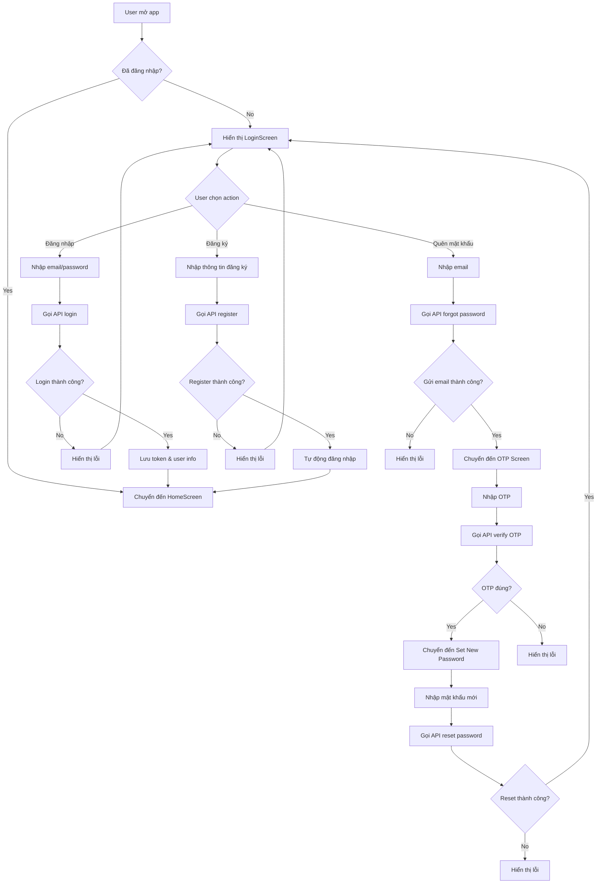

## 5. Flowchart - Quy Trình Đặt Lịch Tiêm Chủng

```mermaid
flowchart TD
    A[User vào HomeScreen] --> B[Chọn "Book Appointment"]
    B --> C[SelectServiceScreen]
    C --> D{Chọn service}
    D --> E[SelectTimeAndSlotScreen]
    E --> F{Chọn date/time}
    F --> G[AppointmentScreen]
    G --> H[Nhập thông tin cá nhân]
    H --> I{Thông tin hợp lệ?}
    I -->|No| J[Hiển thị lỗi validation]
    J --> H
    I -->|Yes| K[Gọi API book appointment]
    K --> L{Booking thành công?}
    L -->|No| M[Hiển thị lỗi]
    M --> G
    L -->|Yes| N[PaymentScreen]
    N --> O{Chọn payment method}
    O --> P[Nhập thông tin thanh toán]
    P --> Q{Payment hợp lệ?}
    Q -->|No| R[Hiển thị lỗi payment]
    R --> P
    Q -->|Yes| S[Gọi API payment]
    S --> T{Payment thành công?}
    T -->|No| U[Hiển thị lỗi]
    U --> N
    T -->|Yes| V[BookingSuccessScreen]
    V --> W[Hiển thị xác nhận booking]
    W --> X[QR Code & thông tin chi tiết]
```

## 6. Flowchart - Quy Trình Tracking Booking

```mermaid
flowchart TD
    A[User vào TrackingBookingScreen] --> B[Load booking history]
    B --> C{Gọi API get booking history}
    C --> D{API thành công?}
    D -->|No| E[Hiển thị lỗi]
    D -->|Yes| F[Phân loại bookings]
    F --> G{Booking hiện tại}
    G --> H[Hiển thị current bookings]
    F --> I{Booking lịch sử}
    I --> J[Hiển thị history bookings]
    
    H --> K{User chọn booking}
    K --> L[Hiển thị chi tiết booking]
    L --> M{Booking status}
    M -->|PENDING| N[Hiển thị "Chờ xác nhận"]
    M -->|CONFIRMED| O[Hiển thị "Đã xác nhận"]
    M -->|COMPLETED| P[Hiển thị "Hoàn thành"]
    M -->|CANCELLED| Q[Hiển thị "Đã hủy"]
    
    N --> R{User muốn hủy?}
    R -->|Yes| S[Gọi API cancel booking]
    S --> T{Cancel thành công?}
    T -->|Yes| U[Cập nhật status]
    T -->|No| V[Hiển thị lỗi]
    U --> B
    V --> N
    R -->|No| W[Quay lại danh sách]
    W --> K
```

## 7. Sơ Đồ UML Component Diagram

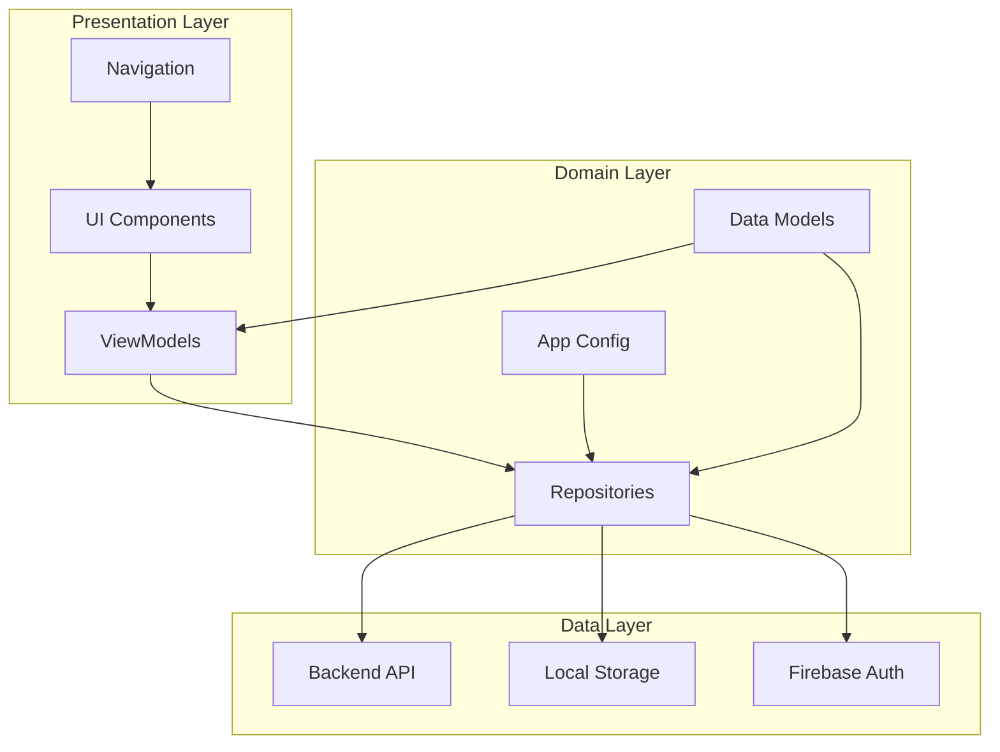

## 8. Sơ Đồ UML State Diagram - Trạng Thái Appointment

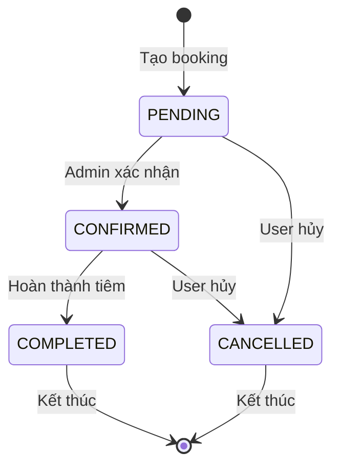

## 9. Sơ Đồ UML Activity Diagram - Quy Trình Tổng Thể

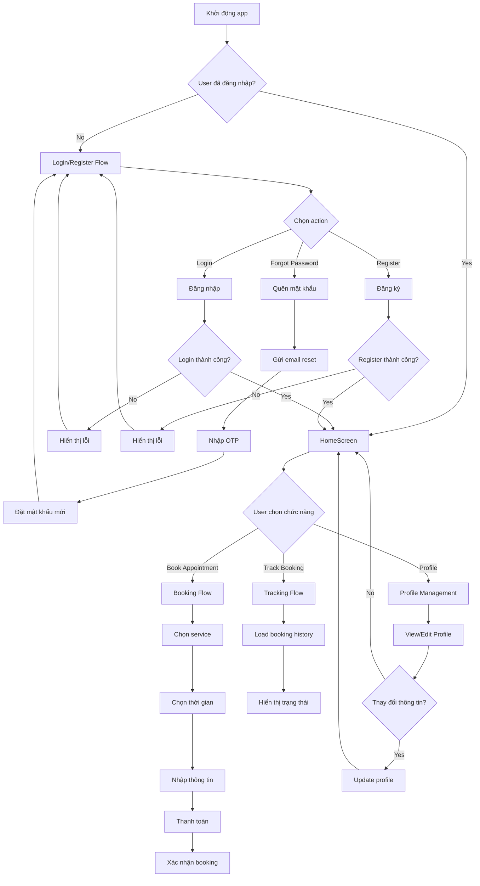

## 10. Sơ Đồ UML Package Diagram

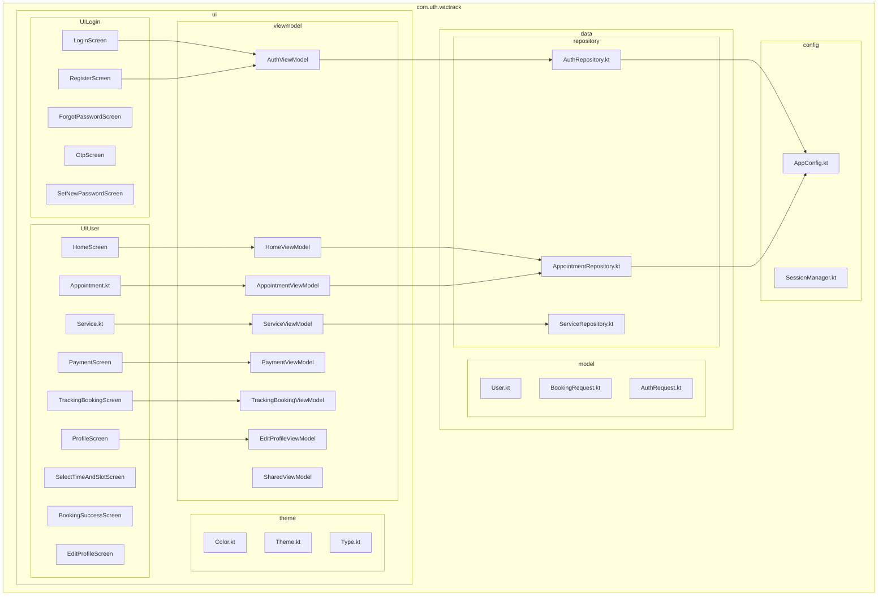

## 11. Sơ Đồ UML Deployment Diagram

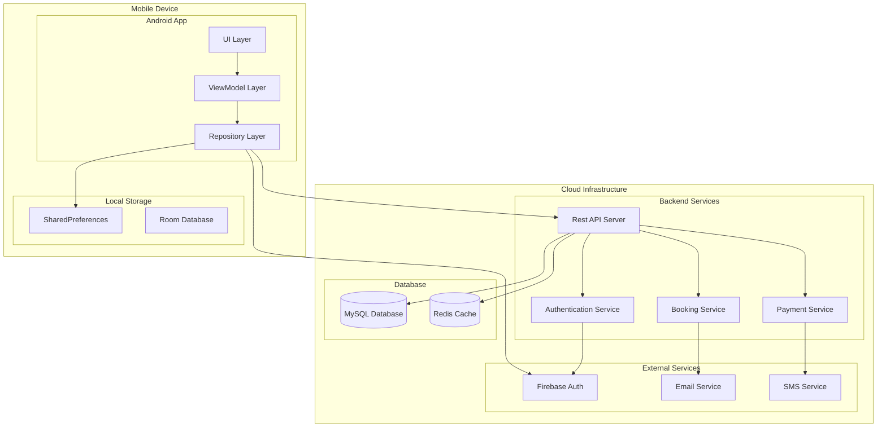

## 12. Sơ Đồ UML Use Case Diagram

```mermaid
graph TB
    subgraph "Actors"
        User[User/Patient]
        Admin[Admin/Doctor]
        System[System]
    end
    
    subgraph "Use Cases"
        UC1[Đăng ký tài khoản]
        UC2[Đăng nhập]
        UC3[Quên mật khẩu]
        UC4[Xem danh sách dịch vụ]
        UC5[Đặt lịch tiêm chủng]
        UC6[Chọn thời gian và slot]
        UC7[Thanh toán]
        UC8[Theo dõi booking]
        UC9[Quản lý profile]
        UC10[Xem lịch sử tiêm chủng]
        UC11[Hủy booking]
        UC12[Xác nhận booking]
        UC13[Gửi thông báo]
    end
    
    %% User relationships
    User --> UC1
    User --> UC2
    User --> UC3
    User --> UC4
    User --> UC5
    User --> UC6
    User --> UC7
    User --> UC8
    User --> UC9
    User --> UC10
    User --> UC11
    
    %% Admin relationships
    Admin --> UC12
    Admin --> UC13
    
    %% System relationships
    System --> UC13
    System --> UC2
    System --> UC3
```

## 13. Sơ Đồ UML Entity Relationship Diagram (ERD)

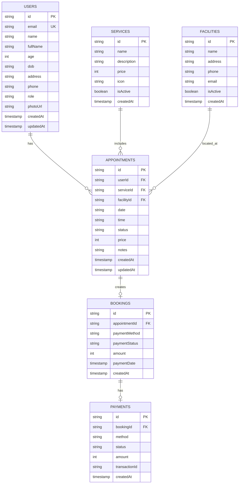

## 14. Sơ Đồ UML Communication Diagram - Booking Flow

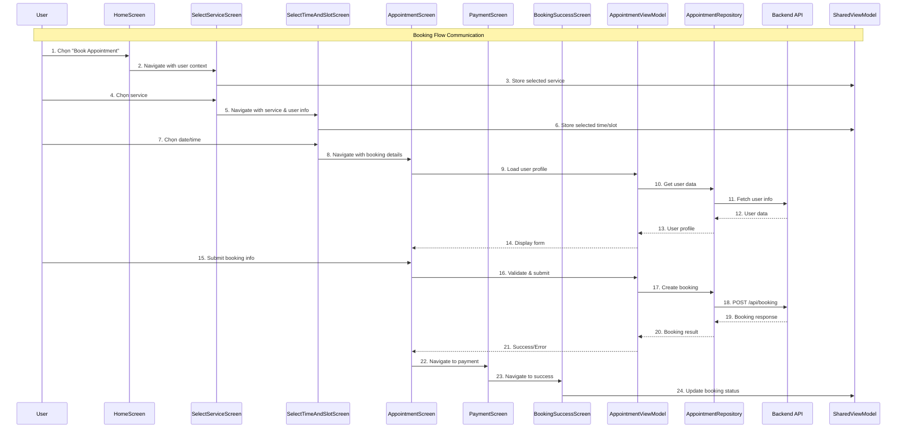

## 15. Sơ Đồ UML Timing Diagram - Authentication Flow

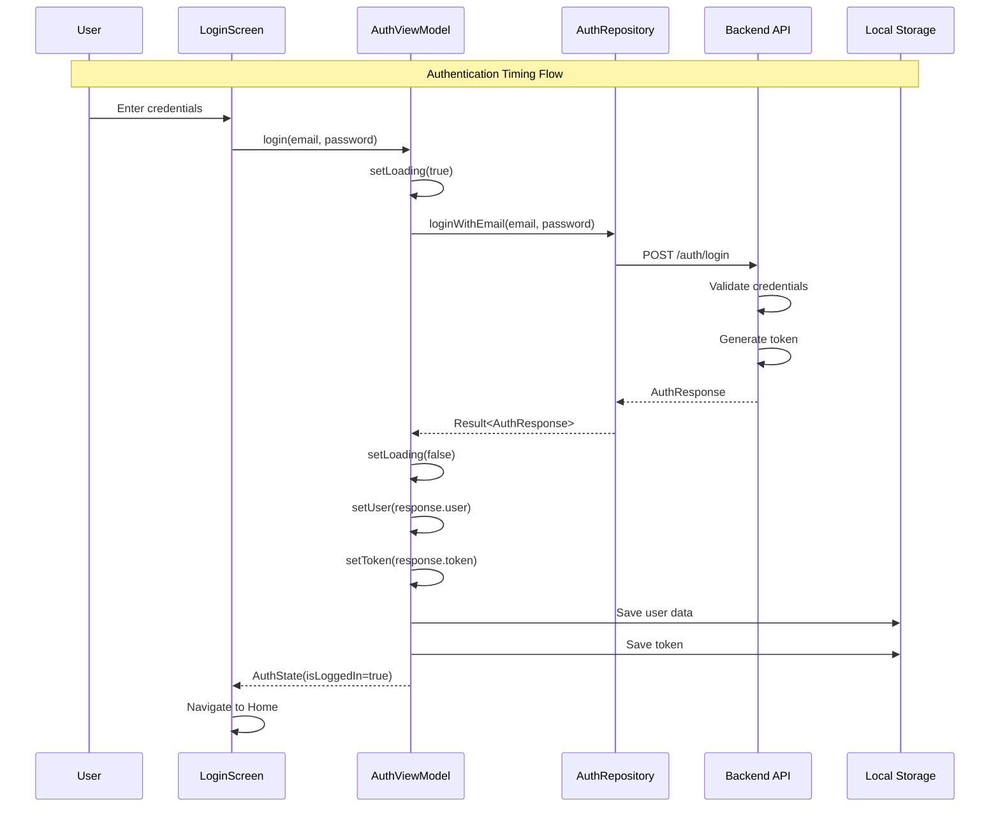

---

## Tóm Tắt Các Sơ Đồ

### 1. **Class Diagram**: Mô tả cấu trúc các class, interface và mối quan hệ giữa chúng
### 2. **Sequence Diagram**: Mô tả luồng tương tác giữa các component theo thời gian
### 3. **Flowchart**: Mô tả logic nghiệp vụ và quy trình xử lý
### 4. **Component Diagram**: Mô tả cấu trúc hệ thống và các module
### 5. **State Diagram**: Mô tả các trạng thái và chuyển đổi trạng thái
### 6. **Activity Diagram**: Mô tả quy trình nghiệp vụ tổng thể
### 7. **Package Diagram**: Mô tả cấu trúc package và module
### 8. **Deployment Diagram**: Mô tả cấu trúc triển khai hệ thống
### 9. **Use Case Diagram**: Mô tả các chức năng và người dùng
### 10. **ERD**: Mô tả cấu trúc cơ sở dữ liệu
### 11. **Communication Diagram**: Mô tả tương tác giữa các object
### 12. **Timing Diagram**: Mô tả timing của các sự kiện

Các sơ đồ này cung cấp cái nhìn toàn diện về kiến trúc, luồng dữ liệu và tương tác trong ứng dụng VacTrack, giúp hiểu rõ cách hệ thống hoạt động và hỗ trợ việc phát triển, bảo trì và mở rộng ứng dụng. 